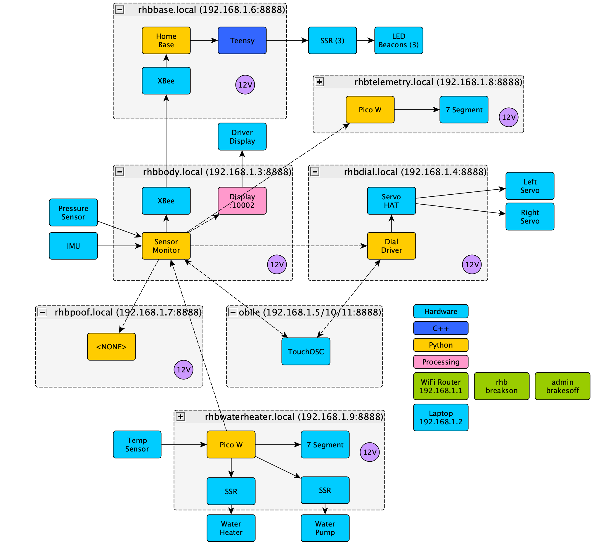

Red Hot Beverly Sensors Monitor
===============================

OSC message ownership
---------------------

Every address has exactly one producer.  A device that does not own an address
must never emit it, and must never re-broadcast one it received.

| Address | Owner | Payload |
| --- | --- | --- |
| `/pressure` | rhb-sensor-monitor | Accumulator pressure, PSI, rounded |
| `/pressure_fine` | rhb-sensor-monitor | Accumulator pressure, PSI, unrounded |
| `/poof_count` | rhb-sensor-monitor | Poofs since startup |
| `/position/lat`, `/position/lon`, `/position/alt`, `/position/inferred_speed` | rhb-sensor-monitor | GPS fix |
| `/imu`, `/heading`, `/cardinal` | rhb-sensor-monitor | BerryIMU orientation |
| `/free_disk` | rhb-sensor-monitor | Free disk, percent |
| `/engine`, `/moving` | rhb-sensor-monitor | Oil pressure and speedometer state |
| `/temperature` | rhb-water-heater | Water bath temperature, deg F.  The only temperature on the network. |
| `/water_heater` | rhb-water-heater | Heater on/off |
| `/upper_temp`, `/lower_temp` | rhb-water-heater | Configured bath setpoints, deg F |
| `/water_pressure` | rhb-water-heater | Bath loop pressure, PSI |
| `/tick/dial`, `/dial_temperature_cpu` | rhb-dial | That device's own health |

Producers send to every listener directly.  Listeners on a port other than 8888
are named `host:port` in the producer's client list -- the body display is
`192.168.1.3:10002`.

Consumers match addresses exactly.  A substring test is not safe here:
`pressure` also matches `/water_pressure` and `/pressure_fine`.

rhb-sensor-monitor records the water bath history it receives into
`water_*.csv` because it is the rig's data logger, but it publishes none of it.

WiFi listeners must not sleep
-----------------------------

Direct delivery assumes every listener answers ARP promptly, and a WiFi board
in its default power-saving mode does not.  The AP buffers frames for a dozing
client until the next DTIM beacon, so replies come back hundreds of
milliseconds late.  Linux senders never notice -- their ARP retries for seconds
and caches the result for minutes.  The water heater's W5500 resolves ARP
inside each `sendto` and gives up, so its messages silently never arrive while
the monitor's do.

Any mains-powered WiFi listener therefore disables power save at startup:

    wlan.config(pm=network.WLAN.PM_NONE)

Symptom when it is missing: one sender reaches a listener and another does not,
with `Operation timed out. No data sent.` on the sender that fails.
