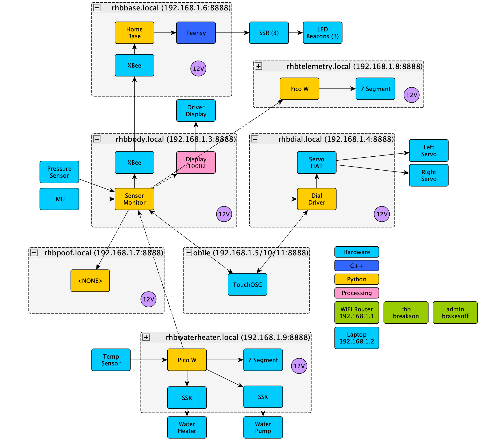

Red Hot Beverly Sensors Monitor
===============================

`rhb-sensor-monitor` is the sensor and telemetry daemon for the Red Hot
Beverly.  It runs on the Raspberry Pi in the body of
the car (`rhbbody.local`, `192.168.1.3`) and is the one process that knows what
the vehicle is physically doing: how much propane pressure is in the
accumulator, when the poofer fires, where the car is, which way it is pointed,
and what the water bath is up to.

It does four jobs:

1. **Read the sensors** -- accumulator pressure over I2C, orientation from a
   BerryIMU, position from `gpsd`, disk health from the filesystem.
2. **Publish over OSC** -- one UDP datagram per value, sent directly to every
   listener on the car: the dial driver, the driver's display, the telemetry
   readout, and phones and tablets running TouchOSC.
3. **Log everything** -- rolling CSV histories of pressure, position, heading,
   disk and the water bath, written to disk every 15 minutes.  This process is
   the rig's data logger, including for values other devices produce.
4. **Phone home** -- the last known position goes out over an XBee serial link
   to the base station, which is off the WiFi network and often out of range of
   it.

The rig
-------

| Host | Address | What runs there |
| --- | --- | --- |
| `rhbbody` | 192.168.1.3 | This monitor, plus the Processing driver display on port 10002 |
| `rhbdial` | 192.168.1.4 | Dial driver -- drives the two gauge servos from `/pressure` |
| `rhbbase` | 192.168.1.6 | Home base: XBee receiver and Teensy driving three LED beacons |
| `rhbtelemetry` | 192.168.1.8 | Pico W with a seven segment display |
| `rhbwaterheater` | 192.168.1.9 | Pico W running the bath: temperature sensor, heater SSR, pump SSR |
| `mobile` | 192.168.1.5, .10, .11 | TouchOSC layouts (`images/mobile_ui.touchosc`) |

Everything is on a single WiFi router at 192.168.1.1 with static addresses;
`config/network.txt` is the authoritative list, and `config/*.service` are the
systemd units that start each piece at boot.

Hardware on this Pi
-------------------

| Sensor | Interface | Module |
| --- | --- | --- |
| Accumulator pressure transducer | ADS1115 ADC at I2C 0x48, +/- 2.048 V, 128 SPS continuous | `pressure_sensor.py` |
| BerryIMU (LSM9DS0 or LSM9DS1) | I2C, tilt compensated heading | `imu/berryIMU.py` |
| GPS | `gpsd` via the `gps3` socket | in the main loop |
| DS18B20 one-wire probe | `/sys/bus/w1/devices/28*` | `temperature_sensor.py`, unused now that the bath owns temperature |
| PiGlow | I2C status LEDs | red = poofing, blue = GPS watchdog blink |
| XBee | `/dev/ttyUSB0` at 9600 baud | coordinator talking to the base router |

Running it
----------

    python3 rhb-sensor-monitor.py

| Option | Default | Meaning |
| --- | --- | --- |
| `--ip` | `192.168.1.3` | Address this monitor's own OSC server binds to, port 8888 |
| `--client_ip` | `192.168.1.4,.5,.8,.9,.10,.11` | Comma separated list of listeners |
| `--client_port` | `8888` | Port those listeners are on |
| `--display_ip` | `127.0.1.1` | The Processing driver display, normally local |
| `--display_port` | `10002` | Port the driver display listens on |

In the car it is started by `rhb_body_driver.service` out of
`/home/pi/development/startup.sh`, with `Restart=always`.  Logs go to
`rhb-sensor-monitor.log`, rotating at 200 KB with five backups.

How the main loop works
-----------------------

`main_loop()` is a single asyncio task that cycles roughly every 50 ms
alongside the OSC server.  Each pass:

* **Persist** any history that has aged past 15 minutes.  This, the 5 second
  rebroadcast, the XBee report and the 500 ms pressure refresh are all timed on
  `time.monotonic()`.  The Pi boots about seven hours fast and the first GPS
  fix sets it back; on the wall clock every interval went negative at that
  step and nothing persisted or rebroadcast until dawn, all of 2026.
* **Pressure.**  Read the ADC, decide whether the sensor is even connected,
  convert to PSI, look for a poof, broadcast.  `/pressure` goes out at least
  every 500 ms so downstream gauges never sit on a stale value.
* **IMU.**  Compute the tilt compensated heading; broadcast only when it has
  moved more than 2 degrees away from the mean of the last five samples.
* **GPS.**  Pull the next `gpsd` sentence.  Once an hour the system clock is
  set from the fix, since this Pi has no RTC.  Position is broadcast when it
  has moved about 0.00005 degrees or 5 m of altitude, along with a speed
  inferred from the geodesic distance to the previous fix.
* **Disk.**  Free space as a percentage, when it changes.  Currently commented
  out of the loop; `/free_disk` only moves if it is turned back on.
* **Periodic rebroadcast.**  Every 5 seconds the last position, heading,
  pressure and poof count go out again, so a listener that just booted or
  dropped a packet converges instead of showing nothing.  Every 50 seconds the
  latest `lat,lon` is pushed over the XBee to the base station.

Every peripheral touching function is wrapped in `@handle_exception`, and the
loop body has its own `try` around it: a sensor that fails logs and is retried
next pass rather than taking the car's instrumentation down.

Poof detection
--------------

`poof_track.py` turns raw ADC counts into PSI (`counts * 10 / 2000 + 10`,
truncated to 0.1) and watches for the pressure drop a firing poofer causes.
While the car is idle it keeps a rolling median of the last 10,000 readings as
the base pressure.  A reading more than 3 PSI away from that base starts a
poof; returning to or below the base ends it.  The result is `/poof_count`,
the red PiGlow LED, and a cumulative poof time.  Base pressure is only updated
while not poofing, so a long burn cannot drag the reference down with it.

Detecting a disconnected sensor
-------------------------------

`pressure_health.py` exists because an unplugged transducer does not read zero
-- the ADC input floats and produces plausible looking numbers in the 0 to
25 PSI band, which the poof tracker would happily interpret as poofing.

The discriminator is smoothness.  Across every archived session from 2023
through 2025 a connected sensor's rolling median sample to sample step stayed
under 400 counts (2 PSI) even through the fastest poofs, while a floating
input put the same statistic at 2100 to 3030 counts.  The threshold sits in
the middle of that gap at 1000 counts (5 PSI), measured over a 40 sample
window.  A reading pegged near the rails (30,000 counts, far beyond the 10,000
that 60 PSI would produce) or a failed I2C read counts as bad as well.

It takes about a second of junk (20 samples) to declare the sensor gone and
two seconds of clean readings (40 samples, a full window) to accept it back.
While disconnected, an in progress poof is ended, no history is recorded, and
the last good pressure keeps being broadcast so the gauges stay alive.

Data logging
------------

`metric_logging.py` accumulates five pandas frames in memory and writes them
to `/home/pi/development/data` every 15 minutes as
`<kind>_YYYYMMDD_HH_MM.csv`:

| File | Columns |
| --- | --- |
| `pressure_*.csv` | timestamp, level |
| `positions_*.csv` | timestamp, lat, lon, alt, speed |
| `heading_*.csv` | timestamp, heading |
| `water_*.csv` | timestamp, temp_f, heater_status, pressure_psi |
| `disk_*.csv` | timestamp, free |

Each period rewrites the current file and then starts a fresh buffer, so a
window is written repeatedly as it fills and closed out when the timestamp
rolls.  Archived runs live in `data/`, and the notebooks in `reporting/`
(`after_activity_report.ipynb`, `voltage.ipynb`) are what the seasons get
summarized with.

OSC message ownership
---------------------

Every address has exactly one producer.  A device that does not own an address
must never emit it, and must never re-broadcast one it received.

| Address | Owner | Payload |
| --- | --- | --- |
| `/pressure` | rhb-sensor-monitor | Accumulator pressure, PSI, rounded |
| `/pressure_fine` | rhb-sensor-monitor | Accumulator pressure, PSI, unrounded |
| `/poof_count` | rhb-sensor-monitor | Poofs since startup |
| `/position/lat`, `/position/lon`, `/position/alt`, `/position/inferred_speed` | rhb-sensor-monitor | GPS fix |
| `/imu`, `/heading`, `/cardinal` | rhb-sensor-monitor | BerryIMU orientation |
| `/free_disk` | rhb-sensor-monitor | Free disk, percent |
| `/temperature` | rhb-water-heater | Water bath temperature, deg F.  The only temperature on the network. |
| `/water_heater` | rhb-water-heater | Heater on/off |
| `/upper_temp`, `/lower_temp` | rhb-water-heater | Configured bath setpoints, deg F |
| `/water_pressure` | rhb-water-heater | Bath loop pressure, PSI |
| `/tick/dial`, `/dial_temperature_cpu` | rhb-dial | That device's own health |

Producers send to every listener directly.  Listeners on a port other than 8888
are named `host:port` in the producer's client list -- the body display is
`192.168.1.3:10002`.

Consumers match addresses exactly.  A substring test is not safe here:
`pressure` also matches `/water_pressure` and `/pressure_fine`.

Publishing must not be able to fail partway.  `broadcast()` isolates every
send, so one unreachable listener cannot silence the ones after it in the
client list, and it also refuses to raise on a value it cannot encode.  Both
matter most to `/poof_count`: it is the only address with no on-change
producer, it is sent from the tail of one periodic function, and the readouts
that show it sit late in the client list while the dial sits first.  The
failure that costs you is silent and asymmetric -- the gauges keep working
while the poof count sits at zero until whatever was broken clears.

rhb-sensor-monitor records the water bath history it receives into
`water_*.csv` because it is the rig's data logger, but it publishes none of it.
Its dispatcher maps only what it records, accepts and drops the two setpoints
the display uses, and logs anything else that arrives as unexpected.

WiFi listeners must not sleep
-----------------------------

Direct delivery assumes every listener answers ARP promptly, and a WiFi board
in its default power-saving mode does not.  The AP buffers frames for a dozing
client until the next DTIM beacon, so replies come back hundreds of
milliseconds late.  Linux senders never notice -- their ARP retries for seconds
and caches the result for minutes.  The water heater's W5500 resolves ARP
inside each `sendto` and gives up, so its messages silently never arrive while
the monitor's do.

Any mains-powered WiFi listener therefore disables power save at startup:

    wlan.config(pm=network.WLAN.PM_NONE)

Symptom when it is missing: one sender reaches a listener and another does not,
with `Operation timed out. No data sent.` on the sender that fails.

Installation and calibration
----------------------------

Dependencies are in `requirements.txt`; `pandas` comes from
`apt-get install python3-pandas` rather than pip on the Pi.  Prebuilt SD card
images for each host are in `config/sd_card_images/`.

After physically mounting the IMU, run
`rhb_sensor_monitor/imu/calibrateBerryIMU.py` and copy the resulting magnetometer
minimums and maximums into `berryIMU.py`; rotate the assembly through more
orientations than feels necessary.  Then update the position of the circle on
the Bev logo so it points the right way relative to the car.  `IMU_UPSIDE_DOWN`
in `berryIMU.py` covers mounting the board with the logo facing up.

Tests
-----

    pytest

`test/` covers the pieces that can run off the car: poof tracking, disconnect
detection against synthesized idle and floating traces, metric logging, and an
OSC sender (`test_osc.py`) that walks every address so listeners can be
exercised from a laptop.  `rhb_sensor_monitor/rhb-test-dial.py` drives the dial
directly for bench testing.

Licensed under the GPL v3; see `LICENSE`.
